# Алгоритм Флойда–Воршала: покроковий розбір

[](https://github.com/MarynaShavlak/algo-floyd-warshall)

**Алгоритм Флойда–Воршала** знаходить **найкоротші шляхи між усіма парами вершин** (all-pairs shortest paths) у зваженому графі. Працює і з додатними, і з від'ємними вагами ребер, але **не допускає циклів від'ємної ваги**.

Це класичний приклад **динамічного програмування**: відстані між парами вершин поступово вдосконалюються, додаючи по одній «дозволеній проміжній вершині» за раз.

Репозиторій — навчальний матеріал: чиста реалізація алгоритму + докладні візуалізації кожного кроку. Увесь розбір нижче відтворюється кодом із [`examples/`](examples), а рисунки лежать у [`docs/images/`](docs/images).

> **Про назви вершин.** Вершини у графі зазвичай нумерують `0–5`. Щоб їхні назви не плутались зі змінною циклу `k`, тут вершини названо **літерами `A–F`** (`A=0, B=1, C=2, D=3, E=4, F=5`).

---

## Зміст

- [Структура репозиторію](#repo-structure)
- [Швидкий старт](#quickstart)
- **Теорія**
  - [Інтуїція: що таке `k` і навіщо кроки](#intuition)
  - [Основна ідея (формальніше)](#idea)
  - [Формула оновлення](#formula)
- **Приклад 1 — граф `A–F` (додатні ваги)**
  - [Граф із прикладу](#graph)
  - [Крок 1. Ініціалізація матриці відстаней](#init)
  - [Кроки 2–3. Ітерації та оновлення](#iterations)
  - [Покроковий розбір по кожній вершині `k`](#walkthrough)
  - [Зведена картина: еволюція матриці](#evolution)
  - [Результат і відновлення шляху](#result)
- **Від'ємні ваги**
  - [Від'ємні цикли](#negative-cycles)
  - [Приклад 2 — повністю від'ємний цикл](#negative-cycle-example)
  - [Приклад 3 — від'ємні ребра (`P, Q, R, S`)](#negative-edges)
- **Підсумки**
  - [Складність і порівняння](#complexity)
  - [Де це застосовується](#applications)
  - [Бонус: чистіша реалізація](#clean)
  - [Підсумок](#summary)
- [Ліцензія](#license)

---

<a id="repo-structure"></a>

## Структура репозиторію

```
floyd-warshall/
├── README.md                          # цей файл — повний навчальний розбір
├── pyproject.toml                     # метадані пакета
├── requirements.txt                   # залежності (matplotlib, networkx, pillow)
├── LICENSE                            # MIT
│
├── floyd_warshall/                    # пакет із кодом
│   ├── __init__.py                    # публічний API
│   ├── core.py                        # сам алгоритм, відновлення шляху, виявлення циклів
│   ├── style.py                       # єдина палітра кольорів + параметри matplotlib
│   ├── visualization.py               # малювання графів, матриць, покрокових кадрів
│   └── animation.py                   # збірка GIF-анімацій із кадрів (через Pillow)
│
├── examples/                          # запускні скрипти, що відтворюють усі рисунки
│   ├── _common.py                     # спільні утиліти прикладів (GraphExample, save_figure, …)
│   ├── _graphs.py                     # дані трьох навчальних графів (єдине джерело правди)
│   ├── 00_airport_analogy.py          # ілюстрації аналогії з аеропортами (розділ «Інтуїція»)
│   ├── 01_graph_abcdef.py             # основний приклад (A–F)
│   ├── 02_negative_cycle.py           # від'ємний цикл (X, Y, Z)
│   ├── 03_negative_edges_pqrs.py      # від'ємні ребра (P, Q, R, S)
│   └── 04_animations.py               # GIF-анімації: еволюція, шлях, хаби, скан, цикл
│
├── tests/                             # тести коректності алгоритму
│   └── test_core.py                   # звірка з networkx, від'ємні цикли, ребра нульової ваги
│
└── docs/images/                       # усі візуалізації (їх генерують скрипти з examples/)
```

**Розподіл відповідальностей.**

- **`core.py`** не залежить від графічних бібліотек — це чистий алгоритм, який можна імпортувати будь-де. Містить `floyd_warshall_steps` (інструментована версія зі знімками), `floyd_warshall` (компактна), `reconstruct_path`, `has_negative_cycle` та хелпер `adjacency_to_inf` (перетворює угоду `0 == немає ребра` на угоду з `∞`).
- **`style.py`** — єдине джерело візуальної теми: палітра кольорів іменованими константами, `FIGURE_DPI`, шрифти та `configure_style()`. Змінити вигляд усіх рисунків можна з однієї точки.
- **`visualization.py`** (потребує `matplotlib` і `networkx`) бере палітру зі `style.py` і малює графи, матриці та покрокові кадри. Публічний `format_value` форматує значення матриці (`∞` для відсутніх).
- **`examples/_common.py`** прибирає дублювання між прикладами: налаштування `Agg`/шляхів, `save_figure`, друк шляхів і `dataclass GraphExample`, що тримає разом мітки вершин, матрицю суміжності та координати.
- **`examples/_graphs.py`** — єдине джерело правди для трьох навчальних графів (`ABCDEF`, `PQRS`, `XYZ`); їх імпортують усі приклади, тож матриці суміжності й координати визначені лише раз.
- Скрипти **`examples/`** лише беруть потрібний граф із `_graphs.py`, викликають алгоритм і функції малювання та зберігають рисунки.

---

<a id="quickstart"></a>

## Швидкий старт

> **Потрібен Python ≥ 3.8.** Код використовує `from __future__ import annotations`, тож працює на 3.8+ (розробляється й тестується на 3.12).

```bash
# 1. Залежності
pip install -r requirements.txt
# або встановити пакет у режимі розробки:
pip install -e .

# 2. Відтворити всі рисунки й текстові виводи
python examples/00_airport_analogy.py      # аналогія з аеропортами
python examples/01_graph_abcdef.py        # граф A–F
python examples/02_negative_cycle.py       # від'ємний цикл
python examples/03_negative_edges_pqrs.py  # від'ємні ребра
python examples/04_animations.py           # GIF-анімації (еволюція, шлях, хаби)
```

П'ять скриптів разом генерують **24 статичні рисунки** (`.png`, ≈2.3 МБ) і **8 GIF-анімацій** (`.gif`, ≈1.1 МБ) у [`docs/images/`](docs/images) та друкують текстові виводи в консоль. Виконуються за кілька секунд.

Перевірити коректність алгоритму (результати звірено з еталонною реалізацією `networkx`):

```bash
python tests/test_core.py     # коректність ядра (без додаткових залежностей)
python tests/test_smoke.py    # smoke: рендер і збірка GIF не падають (matplotlib, pillow)
# або обидва через pytest (pip install -e ".[dev]"):
pytest
```

Тести `test_core.py` покривають збіг з `networkx` на додатних і від'ємних вагах, підтримку ребер нульової ваги, виявлення від'ємного циклу, відновлення шляху через `nxt` та стійкість `reconstruct_path` до від'ємного циклу (без зациклення). Smoke-тести `test_smoke.py` перевіряють, що всі функції малювання та збірка GIF виконуються без помилок, а `report_distances` коректно обробляє пару без шляху.

Мінімальне використання як бібліотеки:

```python
from floyd_warshall import floyd_warshall, reconstruct_path, has_negative_cycle, INF

adj = [
    [0,   3,   INF],
    [INF, 0,   1  ],
    [INF, INF, 0  ],
]
dist = floyd_warshall(adj)        # матриця найкоротших відстаней
```

---

<a id="intuition"></a>

## Інтуїція: що таке `k` і навіщо кроки

Найважливіше для розуміння: **`k` — це вершина графа, а не окремий лічильник кроків.** Зовнішній цикл проходить вершини по черзі, і `k` на кожному кроці — це **та вершина, яку ми щойно «дозволили» використовувати як проміжну (пересадкову) точку**. Тобто `k = A` означає не «нульовий крок», а «тепер маршрутам дозволено йти транзитом через вершину A».

### Аналогія — пересадкові аеропорти

Уявіть вершини як **аеропорти**, а ребра — як **прямі рейси** з їхньою тривалістю. Спочатку матриця `D` знає лише *прямі* перельоти. Ми хочемо знайти найкоротший час між кожною парою аеропортів, дозволяючи пересадки.

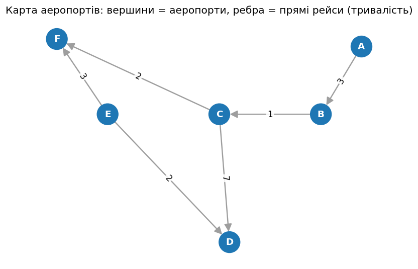

Алгоритм «відкриває» аеропорти як дозволені пересадкові вузли **по одному**:

- `k = A`: «віднині можна робити пересадку в A». Для кожної пари `(i, j)` питаємо: чи `(найкращий i→A) + (найкращий A→j)` швидше за поточний `i→j`? Якщо так — оновлюємо.
- `k = B`: «тепер можна пересідати **також** у B» (вже маючи A). Перевіряємо всі пари знову.
- … і так для **кожної** вершини.

Сам крок перевірки для однієї пари — це і є *релаксація*: порівнюємо **прямий рейс** із **пересадкою через `k`** і лишаємо коротший варіант. У цьому і вся формула `min(пряме, через k)`:

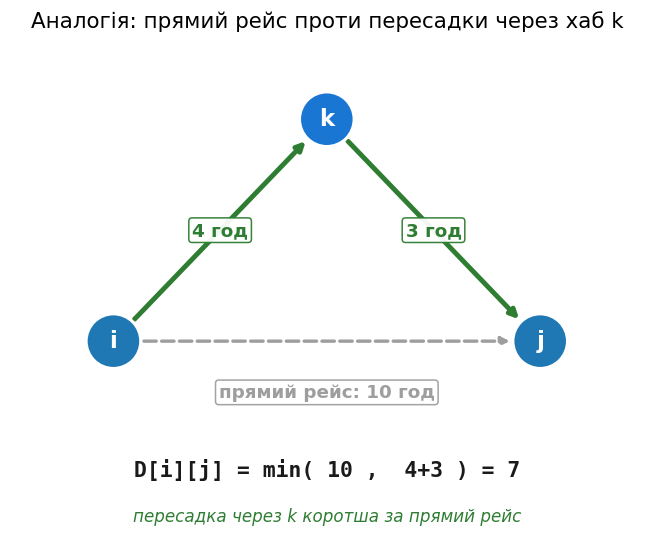

Відкриваючи хаби по черзі, маршрути поступово коротшають: спершу для пари може не бути **жодного** шляху, потім з'являється бодай якийсь, а з кожним новим дозволеним хабом — дедалі коротший:

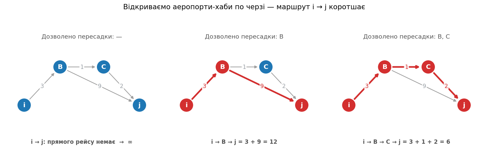

▶️ Те саме в русі — відкриваємо хаби по черзі, і маршрут `i → j` коротшає `∞ → 12 → 6`:

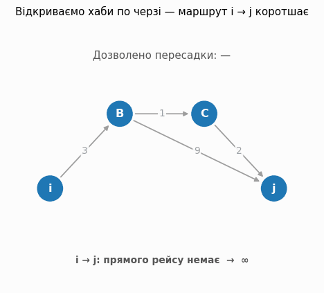

Коли відкрито всі вершини як пересадкові, ми перебрали всі можливі маршрути — і в `D` лишаються справжні найкоротші відстані.

### Чому це працює саме покроково

Коли черга доходить до `k`, значення `D[i][k]` та `D[k][j]` вже враховують пересадки через раніше відкриті вершини. Тому сума `D[i][k] + D[k][j]` — це найкращий маршрут `i → … → k → … → j`, що користується будь-якими вже дозволеними вузлами **плюс** самим `k`.

**Відповідь на типове запитання «що таке `k = A`?»**: це **вершина** (пересадковий вузол поточного кроку). Формально `k` — змінна циклу, але за змістом вона містить *назву вершини*. Порядок, у якому ми відкриваємо вершини, — `A, B, C, …`; тому «номер кроку» і «вершина» тут ідуть пліч-о-пліч.

<a id="idea"></a>

## Основна ідея (формальніше)

Позначимо $D^{(k)}[i][j]$ — довжину найкоротшого шляху з вершини $i$ у вершину $j$, **якщо як проміжні дозволено лише вже «відкриті» вершини** (множину $\{A, \dots, k\}$).

- $D^{(\text{поч})}$ — це просто прямі ребра (жодних проміжних вершин): нулі на діагоналі, ваги ребер, де вони є, і $\infty$ в інших місцях.
- На кожному кроці ми «вмикаємо» ще одну проміжну вершину $k$ і питаємо: *чи можна для пари $(i, j)$ скоротити шлях, пройшовши через $k$?*
- Після того, як перебрано всі вершини, у матриці залишаються справжні найкоротші відстані між усіма парами.

**Ключове спостереження.** Найкоротший шлях, що використовує вже відкриті проміжні вершини, або **взагалі не проходить** через $k$ (тоді відповідь та сама, що й до відкриття $k$), або **проходить** через $k$ рівно один раз — тоді він розпадається на дві частини: $i \to k$ та $k \to j$, кожна з яких користується лише раніше відкритими вершинами.

<a id="formula"></a>

## Формула оновлення (рекурентне співвідношення)

Звідси головна формула:

$$D^{(k)}[i][j] = \min\Big(D^{(\text{до } k)}[i][j],\; D^{(\text{до } k)}[i][k] + D^{(\text{до } k)}[k][j]\Big)$$

Тобто: *стара відстань* проти *шляху через нову проміжну вершину $k$*. Беремо менше.

**Чому матрицю можна оновлювати «на місці»** (без копії)? Під час кроку для $k$ значення $D[i][k]$ та $D[k][j]$ не змінюються, бо будь-яке їх оновлення мало б вигляд $D[i][k] = \min(D[i][k],\, D[i][k] + D[k][k])$, а $D[k][k] = 0$. Отже, рядок $k$ і стовпець $k$ під час «свого» кроку незмінні — результат той самий.

*(У коді ми все ж робимо копію перед кожним кроком — лише щоб підсвітити, які клітинки змінилися.)*

---

<a id="example-1"></a>

## Приклад 1 — граф `A–F` (додатні ваги)

<a id="graph"></a>

### Граф із прикладу

Працюємо з **орієнтованим зваженим** графом (вершини перейменовано на `A–F`). Він заданий **матрицею суміжності**, де `0` означає відсутність ребра:

| i→j | A | B | C | D | E | F |
|---|---|---|---|---|---|---|
| **A** | 0 | 3 | 0 | 0 | 0 | 0 |
| **B** | 0 | 0 | 1 | 0 | 0 | 0 |
| **C** | 0 | 0 | 0 | 7 | 0 | 2 |
| **D** | 0 | 0 | 0 | 0 | 0 | 0 |
| **E** | 0 | 0 | 0 | 2 | 0 | 3 |
| **F** | 0 | 0 | 0 | 0 | 0 | 0 |

Ребра: `A→B (3)`, `B→C (1)`, `C→D (7)`, `C→F (2)`, `E→D (2)`, `E→F (3)`.

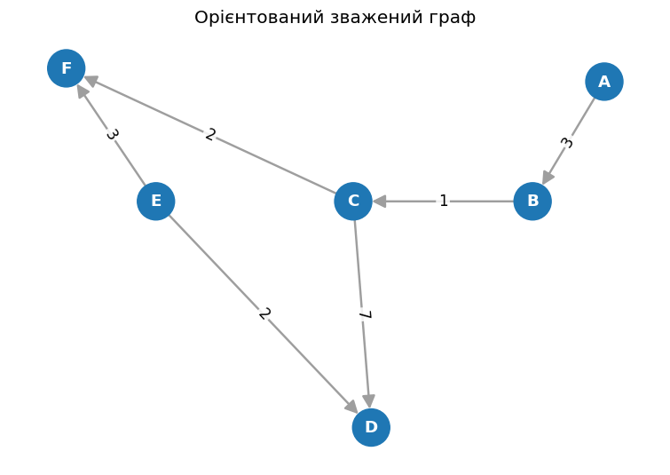

<a id="init"></a>

### Крок 1. Ініціалізація матриці відстаней

Будуємо стартову матрицю:
- `D[i][i] = 0` (відстань від вершини до самої себе);
- `D[i][j] =` вага ребра $i \to j$, якщо воно є;
- `D[i][j] = ∞`, якщо прямого ребра немає.

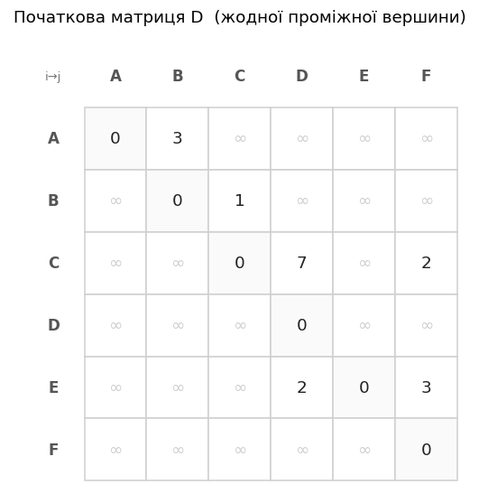

<a id="iterations"></a>

### Кроки 2–3. Ітерації та оновлення

Серце алгоритму — три вкладені цикли. Зовнішній цикл по `k` — це і є «відкриваємо чергову проміжну вершину»; два внутрішні перебирають усі пари `(i, j)`:

```python
for k in range(n):            # k = поточна проміжна вершина (A, B, C, ...)
    for i in range(n):
        for j in range(n):
            if dist[i][k] + dist[k][j] < dist[i][j]:
                dist[i][j] = dist[i][k] + dist[k][j]
```

У навчальній версії ([`floyd_warshall_steps`](floyd_warshall/core.py)) після кожного `k` ми зберігаємо **знімок** матриці та **множину змінених клітинок** (щоб їх підсвітити). Додатково ведемо матрицю `nxt` для відновлення самих шляхів: `nxt[i][j]` — наступна вершина на найкоротшому шляху з `i` до `j`.

▶️ А ось як саме **два внутрішні цикли** перебирають усі пари `(i, j)` за фіксованого `k` — на прикладі найпродуктивнішого кроку `k = C`. Помаранчева рамка — поточна клітинка, синій хрест — опорні рядок і стовпець `k`, зелене — щойно покращена відстань (докладний розбір цих чисел — нижче):

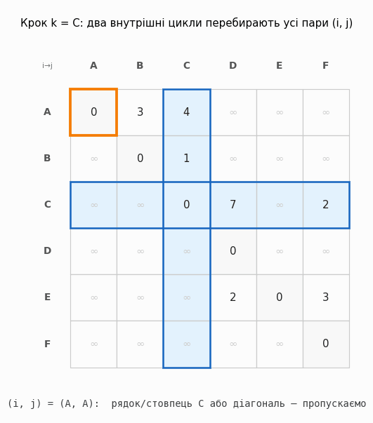

<a id="walkthrough"></a>

### Покроковий розбір: матриця після кожної проміжної вершини `k`

**Нагадування:** `k` — це **вершина**, яку ми дозволяємо як проміжну (пересадкову) на цьому кроці, а не номер кроку.

Як читати візуалізацію:
- 🟦 **синя рамка** — поточна проміжна вершина `k` (її рядок і стовпець дають «опорні» значення $D[i][k]$ та $D[k][j]$);
- 🟩 **зелена клітинка** — відстань, яку щойно покращено на цьому кроці (у дужках — попереднє значення);
- `∞` — шляху поки що немає.

**Підказка для цього графа.** Корисною проміжною вершиною може бути лише «внутрішня» — у яку щось *входить* і з якої щось *виходить*. Тут це лише **B** і **C**. Вершини **A** і **E** — *джерела* (немає вхідних ребер), а **D** і **F** — *стоки* (немає вихідних ребер), тож кроки `k = A, D, E, F` нічого не змінять. Уся «робота» відбувається на `k = B` і `k = C`.

**Детальний кадр.** Під кожним кроком матриця показана у розширеному вигляді: опорний рядок і стовпець `k` підписані стрілками (це джерела значень `D[i][k]` та `D[k][j]`), а **в кожній клітинці, що може оновитися**, записано повну формулу вертикально: спершу символьно `D[i][j] = min( D[i][j], D[i][k]+D[k][j] )`, потім підстановка чисел `= min( … )`, і нарешті результат `= …` жирним (зеленим, якщо клітинка покращилася).

#### Проміжна вершина `k = A`

За цей крок відповідає **одна ітерація зовнішнього циклу** `for k` (тут `k = 0`, вершина `A`), яка виконує оновлення всієї матриці:

```python
for k in range(n):                 # k = 0 → проміжна вершина A
    for i in range(n):             # звідки (рядок)
        for j in range(n):         # куди (стовпець)
            distance[i][j] = min(
                distance[i][j],                   # стара відстань i → j
                distance[i][k] + distance[k][j]   # шлях i → A → j
            )
```

`A` — джерело (немає вхідних ребер), тож не може бути пересадковою. Очікуємо: **без змін**.

**Що означає `D[B][A] + D[A][C]`?** Це **вартість шляху з B до C, який проходить через A** (тобто `B → … → A → … → C`):
- `D[B][A]` — найкоротша відома відстань **з B до A**;
- `D[A][C]` — найкоротша відома відстань **з A до C**;
- сума — «дійти з B до A, а потім з A до C».

**Загальна ідея кроку.** Коли ми «відкриваємо» вершину `k` (тут A), для кожної пари `(i, j)` питаємо: *чи не вийде коротше, якщо дозволити маршруту зробити пересадку в `k`?* Найкоротший шлях `i → j` або **не проходить через `k`** (відповідь лишається старою, `D[i][j]`), або **проходить** (розпадається на `D[i][k] + D[k][j]`). Беремо менше.

**Чому тут виходить ∞.** У цьому графі у вершину A не входить жодне ребро, тож із B до A дістатися неможливо: `D[B][A] = ∞`. Тому `D[B][A] + D[A][C] = ∞ + ∞ = ∞` — маршрут через A не існує, і `min` лишає стару відстань.

```text
============================================================
Крок: проміжна вершина k = A
============================================================
Жодна відстань не покращилася на цьому кроці.
  Причина: у вершину A не входить жодне ребро (D[i][A] = ∞).
```

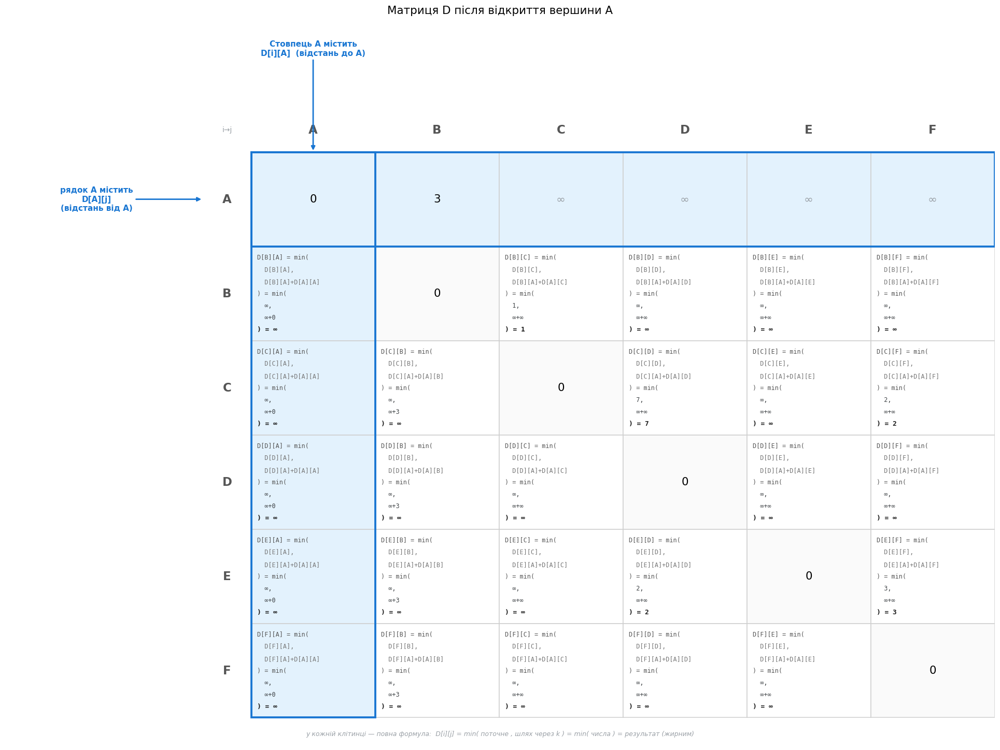

#### Проміжна вершина `k = B`

`B` — внутрішня вершина. Через неї відкривається маршрут `A → B → C`, тож з'явиться `D[A][C] = 4`.

**Чому покращується саме `[A][C]`.** До цього кроку прямого шляху A→C не було (`D[A][C] = ∞`). Але з A до B дістатися можна (`D[A][B] = 3`), і з B до C теж (`D[B][C] = 1`), тож маршрут `A → B → C` існує й коштує `3 + 1 = 4`. Оскільки `4 < ∞`, `min` обирає новий шлях — клітинка стає зеленою.

**А ось де та сама формула поки що не спрацьовує** — для `[A][D]` при `k = B`:
`D[A][D] = min( ∞, D[A][B] + D[B][D] ) = min( ∞, 3 + ∞ ) = ∞`.
З A до B дістатися можна, але з B до D — ще ні (`D[B][D] = ∞`, бо з B виходить лише ребро в C). Маршрут `A → B → D` з'явиться пізніше — після відкриття C.

```text
============================================================
Крок: проміжна вершина k = B
============================================================
Покращено відстаней: 1
  D[A][C]: ∞ → 4   (бо D[A][B] + D[B][C] = 3+1 = 4)
```

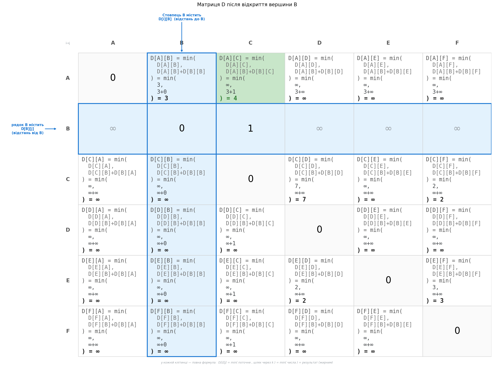

#### Проміжна вершина `k = C`

`C` — головний «хаб» цього графа. Очікуємо одразу **4 покращення** (зокрема `D[A][D] = 11`).

У неї **веде два шляхи** — `A → C = 4` (це насправді `A → B → C`, що з'явилося на кроці `B`) і `B → C = 1`; а з неї **виходять два ребра** — `C → D = 7` та `C → F = 2`. Тому, відкривши C, ми отримуємо `2 × 2 = 4` нові маршрути: з `{A, B}` у `{D, F}`. Усі рахуються за тією самою формулою `min( старе, D[i][C] + D[C][j] )`.

**`[A][D] → 11`** — `D[A][C] + D[C][D] = 4 + 7 = 11` (шлях `A → C → D`, повністю `A → B → C → D`).
**`[B][D] → 8`** — `D[B][C] + D[C][D] = 1 + 7 = 8` (шлях `B → C → D`).
**`[A][F] → 6`** — `D[A][C] + D[C][F] = 4 + 2 = 6` (шлях `A → C → F`, тобто `A → B → C → F`).
**`[B][F] → 3`** — `D[B][C] + D[C][F] = 1 + 2 = 3` (шлях `B → C → F`).

**Ключова ідея.** Числа `4` (для `A → C`) і `1` (для `B → C`) вже містять усі раніше дозволені пересадки. Тому, коли C додає свої вихідні ребра (`+7` до D, `+2` до F), формула автоматично «доклеює» нову ділянку до вже знайденого найкоротшого початку — і так із коротких шматків збираються довші маршрути. Це і є суть динамічного програмування у Флойда–Воршала.

```text
============================================================
Крок: проміжна вершина k = C
============================================================
Покращено відстаней: 4
  D[A][D]: ∞ → 11   (бо D[A][C] + D[C][D] = 4+7 = 11)
  D[A][F]: ∞ → 6   (бо D[A][C] + D[C][F] = 4+2 = 6)
  D[B][D]: ∞ → 8   (бо D[B][C] + D[C][D] = 1+7 = 8)
  D[B][F]: ∞ → 3   (бо D[B][C] + D[C][F] = 1+2 = 3)
```

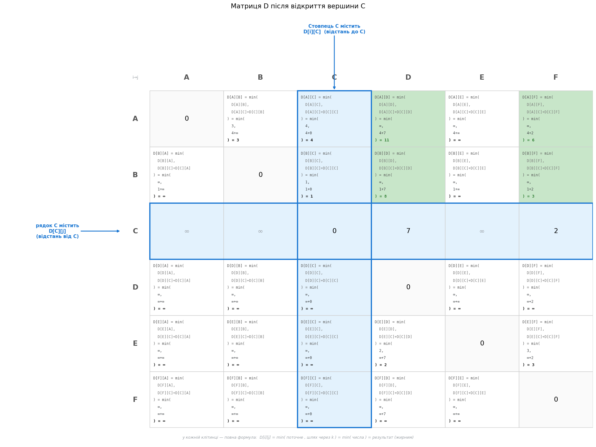

#### Проміжна вершина `k = D`

`D` — стік (немає вихідних ребер). **Без змін**.

```text
============================================================
Крок: проміжна вершина k = D
============================================================
Жодна відстань не покращилася на цьому кроці.
  Причина: з вершини D не виходить жодне ребро (D[D][j] = ∞).
```

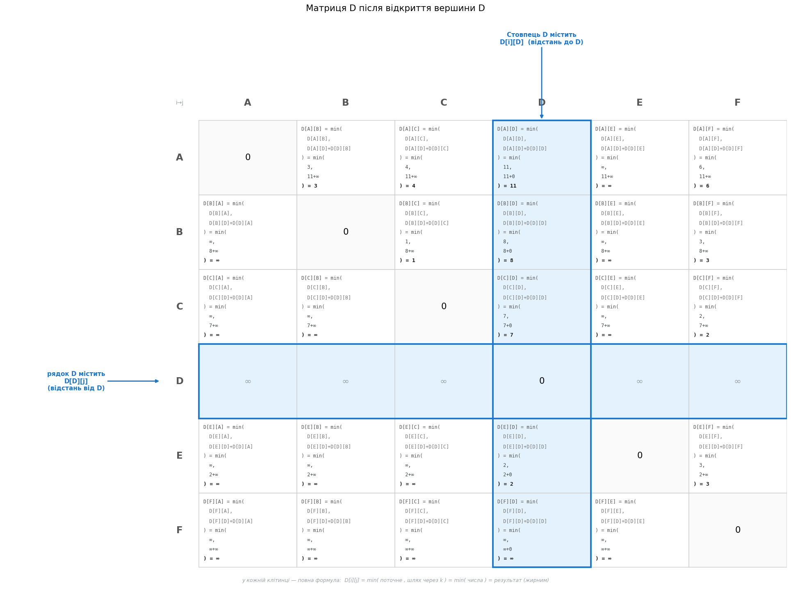

#### Проміжна вершина `k = E`

`E` — джерело (немає вхідних ребер). **Без змін**.

```text
============================================================
Крок: проміжна вершина k = E
============================================================
Жодна відстань не покращилася на цьому кроці.
  Причина: у вершину E не входить жодне ребро (D[i][E] = ∞).
```

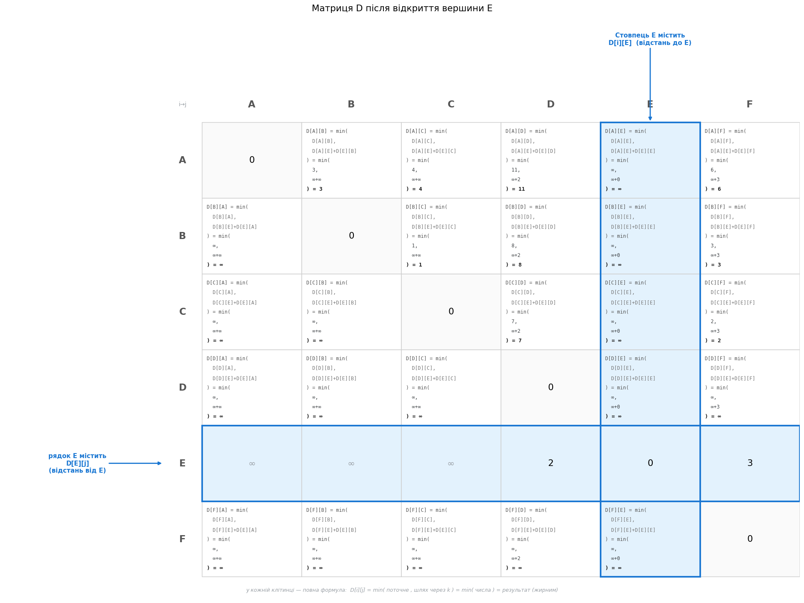

#### Проміжна вершина `k = F`

`F` — стік. **Без змін**: матриця стабілізувалася ще після `k = C`.

```text
============================================================
Крок: проміжна вершина k = F
============================================================
Жодна відстань не покращилася на цьому кроці.
  Причина: з вершини F не виходить жодне ребро (D[F][j] = ∞).
```

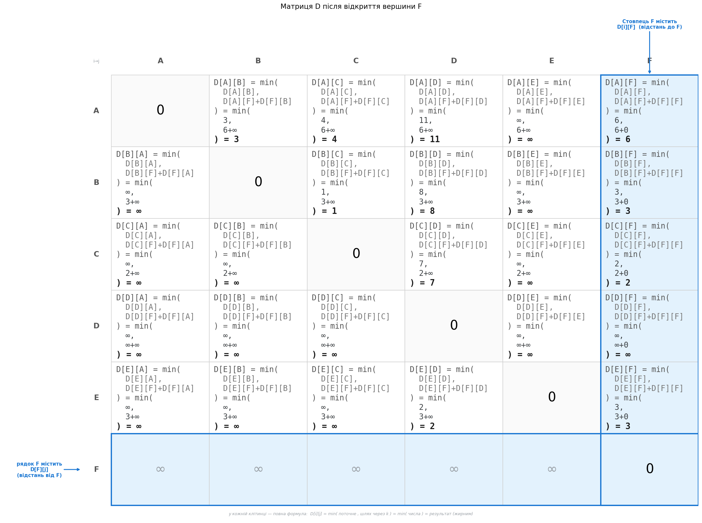

<a id="evolution"></a>

### Зведена картина: еволюція матриці

Усі знімки разом. Видно, що матриця «дозріває» вже після відкриття `C`, а решта кроків лишають її без змін.

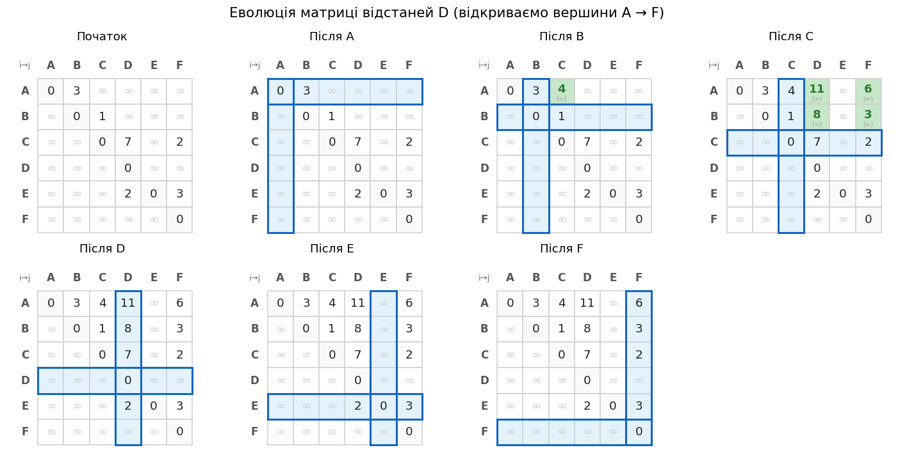

▶️ Та сама еволюція як анімація — зелене «спалахує» рівно на тому кроці, де відстань покращилася (уся робота на `k = B` і `k = C`):

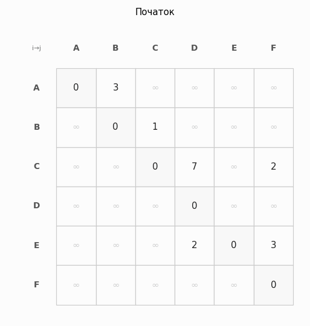

<a id="result"></a>

### Результат і відновлення шляху

Після всіх ітерацій матриця містить найкоротші відстані між усіма парами. Наприклад, `D[A][D] = 11`. Але `D` каже лише **скільки коштує** найкоротший шлях, а не **яким він іде**. Щоб відновити сам маршрут, ми паралельно ведемо ще одну матрицю — `nxt`.

#### Матриця `nxt`: «куди ступити першим кроком»

Ідея проста: `nxt[i][j]` — це **наступна вершина після `i`** на найкоротшому шляху з `i` до `j`. Якщо для кожної пари знати «перший крок», увесь маршрут розгортається сам: ступаємо в `nxt[i][j]`, опиняємось у новій вершині й повторюємо, доки не дійдемо до `j`.

**Ініціалізація.** Спочатку відомі лише прямі ребра, тож перший крок шляху `i → j` — це сама `j` (якщо ребро є), інакше шляху ще немає (`None`):

```python
# nxt[i][j] = j для кожної відомої (скінченної) відстані, інакше None
nxt = [
    [j if dist[i][j] != INF else None for j in range(n)]
    for i in range(n)
]
```

**Оновлення разом із відстанню.** Щоразу, коли релаксація знаходить коротший шлях `i → j` *через* `k`, перший крок маршруту `i → j` стає таким самим, як перший крок маршруту `i → k`:

```python
if dist[i][k] + dist[k][j] < dist[i][j]:
    dist[i][j] = dist[i][k] + dist[k][j]
    nxt[i][j] = nxt[i][k]   # шлях i → j тепер починається так само, як i → k
```

Чому саме `nxt[i][k]`, а не `k`? Бо найкоротший шлях `i → k` сам міг проходити через раніше відкриті вершини. Нас цікавить **самий перший** крок усього маршруту `i → … → k → … → j`, а він збігається з першим кроком його початкової ділянки `i → k`.

#### Розгортання шляху

Маючи готову `nxt`, повний маршрут будуємо простим циклом «йди за вказівниками, доки не прийдеш» (це і робить [`reconstruct_path`](floyd_warshall/core.py)):

```python
def reconstruct_path(nxt, u, v):
    if nxt[u][v] is None:
        return None          # шляху не існує
    path = [u]
    while u != v:
        u = nxt[u][v]        # ступаємо на перший крок до v...
        path.append(u)       # ...і так, доки не дійдемо
        if len(path) > len(nxt):   # від'ємний цикл на маршруті —
            raise ValueError("маршрут проходить через від'ємний цикл")  # інакше зациклимось
    return path
```

**Приклад для `A → D`.** Розгортаємо за `nxt`: `A → nxt[A][D] = B`, далі `B → nxt[B][D] = C`, далі `C → nxt[C][D] = D` — прийшли. Отриманий шлях `A → B → C → D` точно відповідає `D[A][D] = 11`.

```text
       A    B    C    D    E    F
   A |   0    3    4   11    ∞    6
   B |   ∞    0    1    8    ∞    3
   C |   ∞    ∞    0    7    ∞    2
   D |   ∞    ∞    ∞    0    ∞    ∞
   E |   ∞    ∞    ∞    2    0    3
   F |   ∞    ∞    ∞    ∞    ∞    0

Найкоротший шлях A → D:  A → B → C → D   (довжина = 11)
Найкоротший шлях A → F:  A → B → C → F   (довжина = 6)
Найкоротший шлях A → C:  A → B → C   (довжина = 4)
```

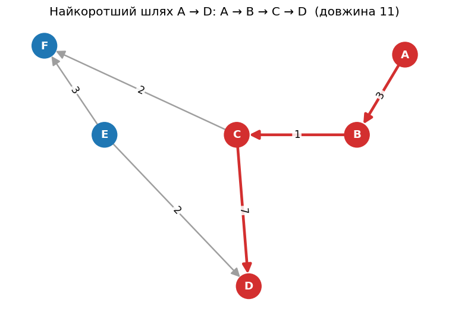

▶️ Як [`reconstruct_path`](floyd_warshall/core.py) розгортає маршрут — крок за кроком «йдемо за вказівниками» `nxt` (`A → B → C → D`):

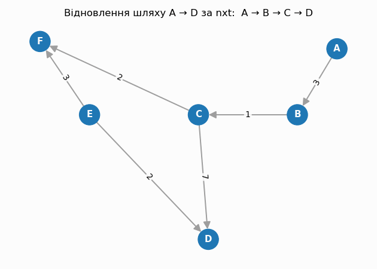

---

<a id="negative-cycles"></a>

## Від'ємні цикли

Алгоритм коректно працює з від'ємними **ребрами**, але **не з від'ємними циклами**: якщо такий цикл є, «найкоротшого» шляху не існує (його довжину можна зменшувати нескінченно).

Зручний спосіб **виявити** від'ємний цикл — запустити алгоритм і перевірити діагональ: якщо для якоїсь вершини `D[i][i] < 0`, вона лежить на досяжному від'ємному циклі.

> **Чого цей критерій не дає.** `D[i][i] < 0` сигналізує, що від'ємний цикл *існує* і що вершина `i` його досягає, але **не вказує, які саме ребра** утворюють цикл. Щоб дістати сам цикл, потрібен окремий прохід (наприклад, відстеження попередників). Тут ми обмежуємось фактом наявності — цього достатньо, щоб зрозуміти: результат алгоритму для такого графа недійсний.

```python
from floyd_warshall import floyd_warshall_steps, has_negative_cycle

# граф із 3 вершин (A, B, C) і циклом A → B → C → A вагою 1 + (-1) + (-1) = -1 < 0
neg = [
    [0,  1,  0],
    [0,  0, -1],
    [-1, 0,  0],
]
dist, _, _ = floyd_warshall_steps(neg)
print(has_negative_cycle(dist))   # → True  (на діагоналі є від'ємні значення)
```

```text
Діагональ матриці (вершини A, B, C): [-1, -1, -2]
Виявлено від'ємний цикл: True
```

<a id="negative-cycle-example"></a>

## Приклад 2 — повністю від'ємний цикл (усі ребра від'ємні)

Розглянемо три вершини `X, Y, Z`, де **всі** ребра циклу від'ємні: `X → Y = −1`, `Y → Z = −1`, `Z → X = −1`. Сума ваг циклу = `−3 < 0` — це **від'ємний цикл**.

> **Чому без покрокових кадрів.** На відміну від прикладів 1 і 3, тут ми навмисно не показуємо матрицю «після кожного `k`»: для від'ємного циклу значення `D[i][j]` не сходяться до осмисленої відповіді (справжня — `−∞`), тож покрокові знімки лише створювали б ілюзію коректного результату. Натомість дивимось на діагональ підсумкової матриці — цього досить, щоб діагностувати проблему.

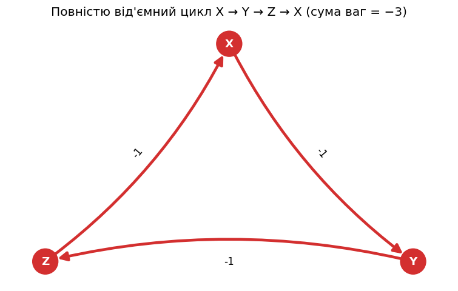

▶️ Обхід циклу з накопиченням ваги: кожне пройдене ребро додає `−1`, і сума падає `0, −1, −2, …` без дна — обходити можна нескінченно:

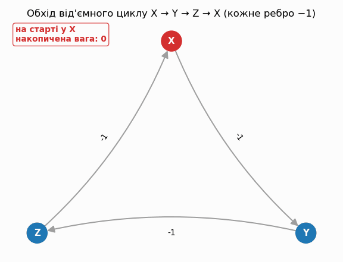

**Чому тут немає найкоротшого шляху.** Кожен повний обхід `X → Y → Z → X` додає `−3` до загальної ваги. Тому що більше разів обходити цикл, то «коротший» (менший за вагою) шлях — і так нескінченно: `−3, −6, −9, … → −∞`. Мінімуму не існує, тож поняття «найкоротший шлях» втрачає сенс.

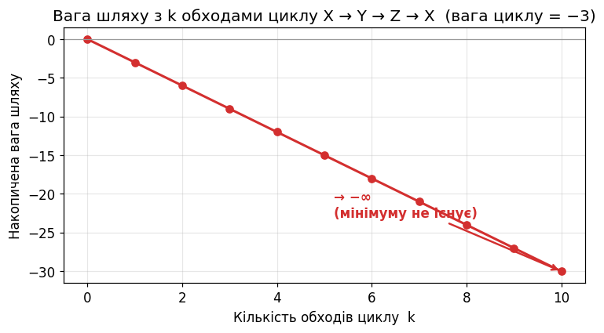

▶️ Те саме як анімація — вага `−3, −6, −9, …` додається обхід за обходом і прямує до `−∞`:

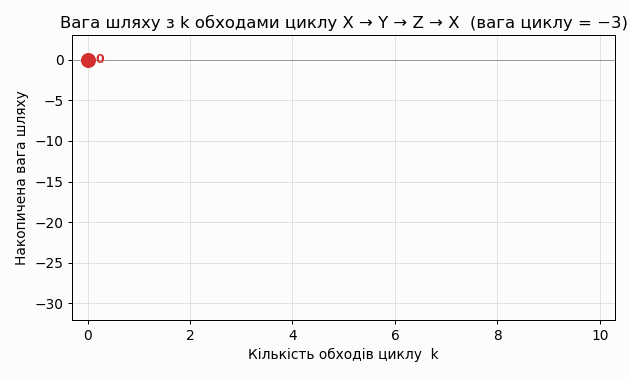

**Чому алгоритм не може це обробити.** Флойд–Воршал припускає, що найкоротші відстані — скінченні числа, і повертає скінченну матрицю. Але для такого графа ці числа **неправильні** (справжня відповідь — `−∞`). Ознака проблеми — діагональ: якщо після алгоритму `D[i][i] < 0`, вершина `i` лежить на досяжному від'ємному циклі (вона «повертається в себе» з від'ємною вагою).

```text
Діагональ матриці D після Флойда–Воршала (вершини X, Y, Z): ['-3', '-3', '-6']
Є вершина з D[i][i] < 0  →  виявлено від'ємний цикл: True

Числа поза діагоналлю алгоритм теж повертає скінченними, але вони НЕ є
справжніми найкоротшими відстанями — насправді для цих пар відповідь −∞.
```

<a id="negative-edges"></a>

## Приклад 3 — від'ємні ребра (вузли `P, Q, R, S`)

Флойд–Воршал, на відміну від Дейкстри, **коректно працює з від'ємними вагами** (якщо немає від'ємного циклу). Граф: `P→Q = 4`, `Q→R = −2` (від'ємне ребро), `R→S = 3`, `P→S = 10`. У вершину `P` не входить жодне ребро, з вершини `S` не виходить жодне ребро. Нижче — ті самі покрокові таблиці, що й для графа `A–F`.

> **Чому новий граф, а не A–F із від'ємними ребрами.** У графі A–F до кожної вершини веде **рівно один маршрут** (він деревоподібний), тож від'ємне ребро там лише змінило б якесь число — і не виникло б жодної «гонки маршрутів». А весь сенс від'ємних ваг саме в тому, що **довший обхід може обігнати пряме ребро**: тут пряме `P → S = 10` програє шляху `P → Q → R → S = 5`. Для цього потрібна пара вершин, у якої є *і* пряме ребро, *і* альтернативний обхід — тому беремо новий маленький граф, спеціально побудований навколо цього контрасту.

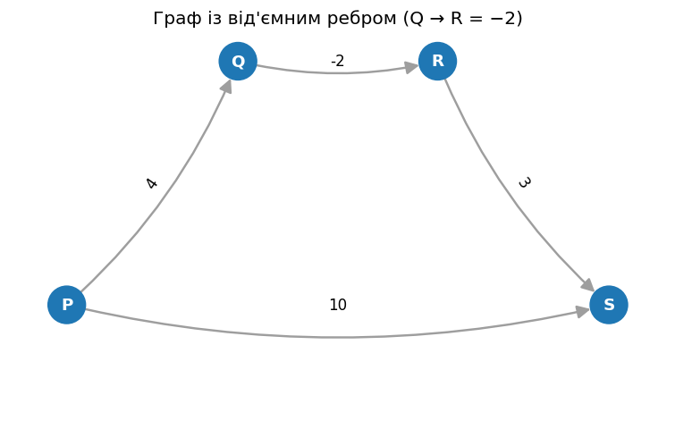

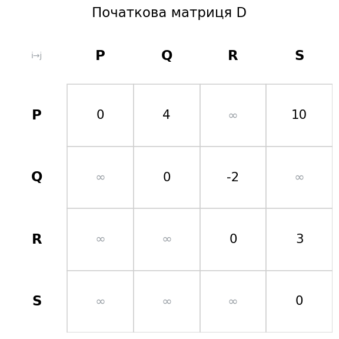

### Крок: проміжна вершина `k = P`

Перша ітерація. У вершину `P` не входить жодне ребро, тож вона не може бути проміжною — **жодних змін**.

```text
============================================================
Крок: проміжна вершина k = P
============================================================
Жодна відстань не покращилася на цьому кроці.
  Причина: у вершину P не входить жодне ребро (D[i][P] = ∞).
```

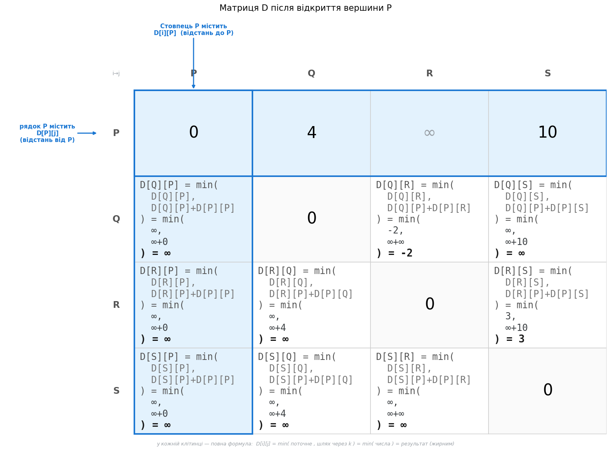

### Крок: проміжна вершина `k = Q`

Через `Q` з'являється шлях `P → R`:
`D[P][R] = min( ∞, D[P][Q] + D[Q][R] ) = min( ∞, 4 + (−2) ) = 2`.
Тут **уперше працює від'ємне ребро** `Q→R = −2`: маршрут `P → Q → R` коштує `4 − 2 = 2`.

```text
============================================================
Крок: проміжна вершина k = Q
============================================================
Покращено відстаней: 1
  D[P][R]: ∞ → 2   (бо D[P][Q] + D[Q][R] = 4+(-2) = 2)
```

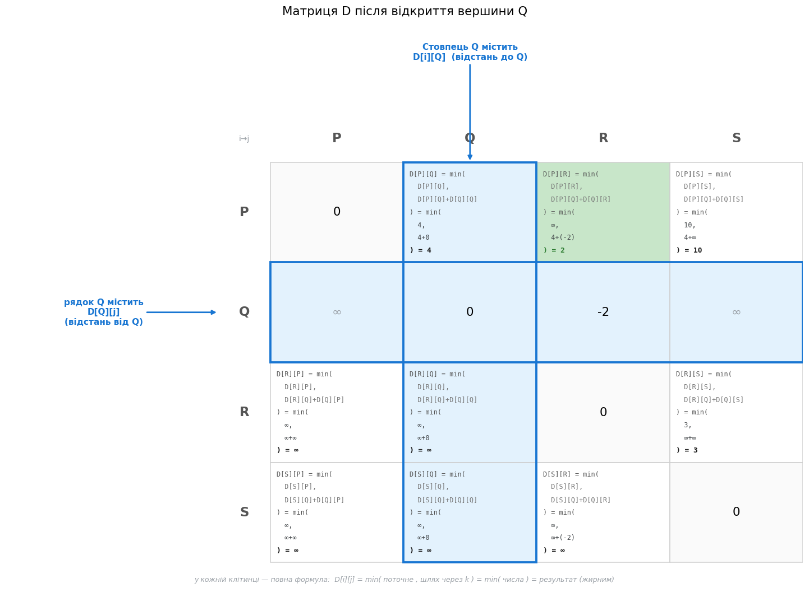

### Крок: проміжна вершина `k = R`

Одразу **два покращення**:
- `D[Q][S] = min( ∞, −2 + 3 ) = 1` — шлях `Q → R → S`;
- `D[P][S] = min( 10, 2 + 3 ) = 5` — шлях `P → Q → R → S`.

Найважливіше: **пряме ребро `P → S = 10` програє довшому шляху завдовжки `5`**, бо той використовує від'ємне ребро. Саме тому для графів із від'ємними вагами **не можна застосовувати Дейкстру**, а Флойд–Воршал працює правильно.

```text
============================================================
Крок: проміжна вершина k = R
============================================================
Покращено відстаней: 2
  D[P][S]: 10 → 5   (бо D[P][R] + D[R][S] = 2+3 = 5)
  D[Q][S]: ∞ → 1   (бо D[Q][R] + D[R][S] = -2+3 = 1)
```

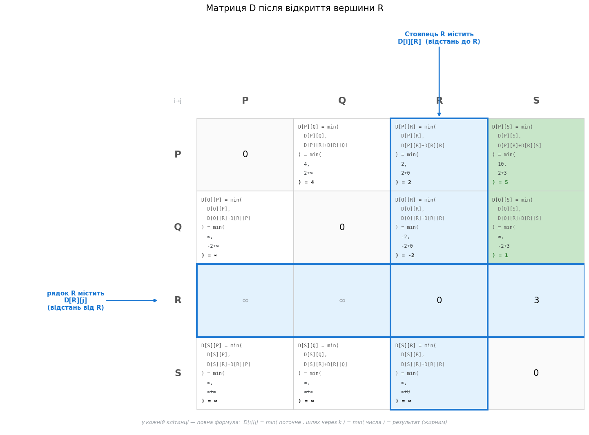

### Крок: проміжна вершина `k = S`

Остання ітерація. З вершини `S` не виходить жодне ребро — **жодних змін**.

```text
============================================================
Крок: проміжна вершина k = S
============================================================
Жодна відстань не покращилася на цьому кроці.
  Причина: з вершини S не виходить жодне ребро (D[S][j] = ∞).
```

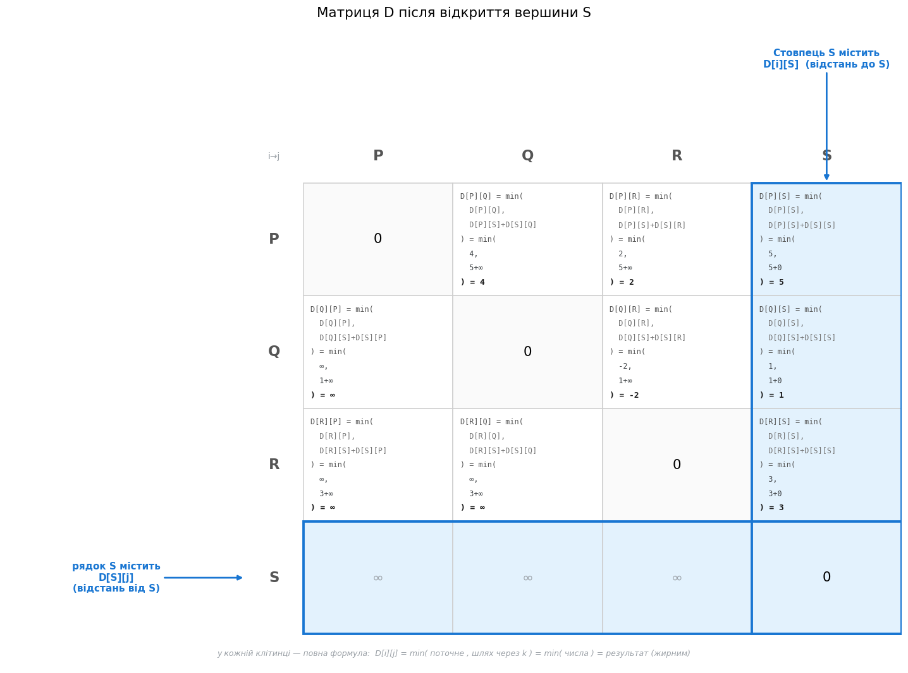

### Зведена картина: еволюція матриці (від'ємний приклад)

Усі знімки матриці `D` поряд: початок і стан після відкриття кожної вершини `P → S`. Синім — опорний рядок/стовпець `k`, зеленим — клітинки, що покращилися на цьому кроці (у дужках — попереднє значення).

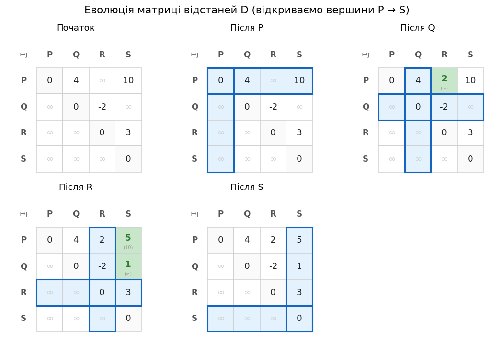

▶️ Анімована еволюція — добре видно ключовий момент на `k = R`: `D[P][S]` падає `10 → 5` (пряме ребро програє шляху через від'ємне):

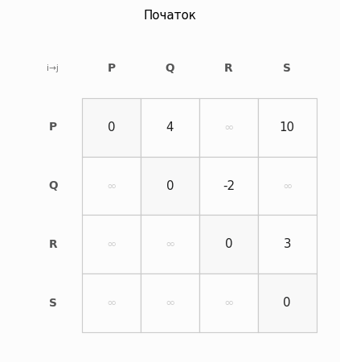

### Результат і відновлення шляху (від'ємний приклад)

Підсумкова матриця містить найкоротші відстані між усіма парами. Звернімо увагу на `P → S`: маршрут іде `P → Q → R → S` (довжина 5), хоча є й пряме ребро `P → S = 10`.

```text
       P    Q    R    S
   P |   0    4    2    5
   Q |   ∞    0   -2    1
   R |   ∞    ∞    0    3
   S |   ∞    ∞    ∞    0

Найкоротший шлях P → R:  P → Q → R   (довжина = 2)
Найкоротший шлях P → S:  P → Q → R → S   (довжина = 5)
Найкоротший шлях Q → S:  Q → R → S   (довжина = 1)
```

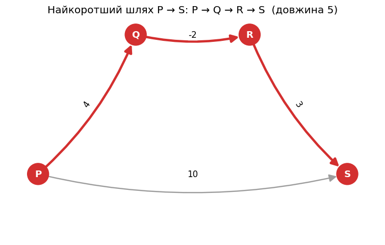

▶️ Розгортання маршруту за `nxt`: червоний шлях `P → Q → R → S` (через від'ємне ребро) виграє в прямого ребра `P → S = 10`, що лишається сірим:

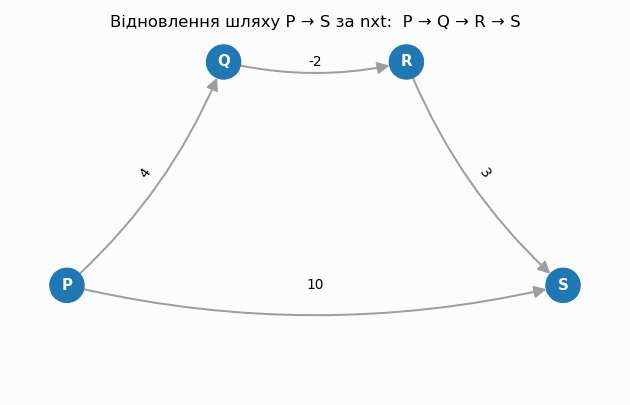

### Підсумкова матриця найкоротших відстаней

`∞` означає, що шляху не існує. Звернімо увагу на `D[P][S] = 5` (а не `10`) — це ефект від'ємного ребра.

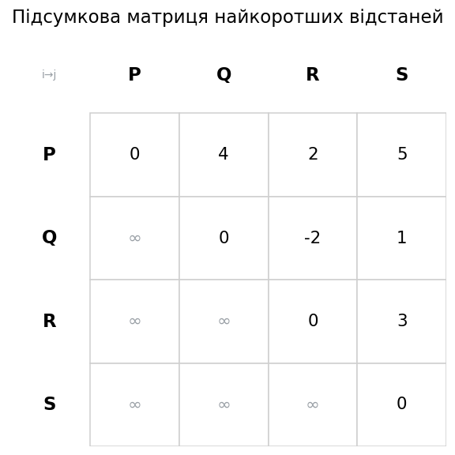

---

<a id="complexity"></a>

## Складність і порівняння

**Час:** $O(n^3)$ — три вкладені цикли по $n$ вершин. **Пам'ять:** $O(n^2)$ на матрицю відстаней (плюс ще $O(n^2)$, якщо відновлюємо шляхи).

| Задача / алгоритм | Складність | Від'ємні ваги | Коли краще |
|---|---|---|---|
| **Флойд–Воршал** (усі пари) | $O(n^3)$ | так (без від'ємних циклів) | щільні графи, потрібні всі пари, простий код |
| Дейкстра з кожної вершини | $O(n \cdot (E + n)\log n)$ | **ні** | розріджені графи, лише додатні ваги |
| Беллман–Форд з кожної вершини | $O(n^2 \cdot E)$ | так | розріджені графи з від'ємними вагами |

Для невеликих/середніх щільних графів простота й сталий патерн доступу до пам'яті роблять Флойда–Воршала дуже зручним.

<a id="applications"></a>

## Де це застосовується

Алгоритм потрібен не лише в навчальних задачах — той самий «потрійний цикл» лежить в основі кількох практичних застосувань:

- **Маршрутизація в мережах.** Обчислення найкоротших шляхів між усіма вузлами — наприклад, у протоколах стану каналів або при плануванні трафіку, коли граф невеликий і щільний.
- **Транзитивне замикання графа** (алгоритм Воршала). Якщо замінити `min`/`+` на логічні `or`/`and`, та сама схема за $O(n^3)$ відповідає на питання «чи досяжна вершина `j` з вершини `i`?» для всіх пар.
- **Аналіз досяжності та залежностей.** Будь-де, де треба знати зв'язність «кожен з кожним»: залежності задач, досяжність станів, відношення «передує» у графі.
- **Метрики на графах.** Через матрицю всіх найкоротших відстаней рахують, наприклад, ексцентриситет вершин, діаметр і радіус графа.

Спільна риса всіх цих задач — потрібні **всі пари** відстаней/зв'язків одразу, а граф достатньо малий, щоб $O(n^3)$ був прийнятним.

<a id="clean"></a>

## Бонус: чистіша реалізація

У класичній реалізації (з угодою «`0` = немає ребра») ребро з вагою `0` неможливо відрізнити від відсутнього (через умову `if graph[i][j] != 0`). Надійніше задавати матрицю одразу через $\infty$ для відсутніх ребер — тоді коректно підтримуються й ребра нульової ваги. Сам алгоритм стає зовсім коротким (див. [`floyd_warshall`](floyd_warshall/core.py)):

```python
def floyd_warshall(adj):
    '''adj[i][j] = вага ребра або float('inf'), якщо ребра немає; 0 на діагоналі.'''
    n = len(adj)
    dist = [row[:] for row in adj]
    for k in range(n):
        for i in range(n):
            for j in range(n):
                if dist[i][k] + dist[k][j] < dist[i][j]:
                    dist[i][j] = dist[i][k] + dist[k][j]
    return dist
```

Той самий граф `A–F`, але вже з `∞` замість `0` для відсутніх ребер, дає той самий результат:

```text
       A    B    C    D    E    F
   A |   0    3    4   11    ∞    6
   B |   ∞    0    1    8    ∞    3
   C |   ∞    ∞    0    7    ∞    2
   D |   ∞    ∞    ∞    0    ∞    ∞
   E |   ∞    ∞    ∞    2    0    3
   F |   ∞    ∞    ∞    ∞    ∞    0
```

<a id="summary"></a>

## Підсумок

- `k` — це **вершина** (пересадковий вузол поточного кроку), яку ми «відкриваємо» як дозволену проміжну; вершини відкриваються по черзі `A → F`.
- Формула: $D^{(k)}[i][j] = \min\big(D[i][j],\, D[i][k] + D[k][j]\big)$ — «старий шлях» проти «шляху через нову проміжну вершину».
- Ініціалізація: нулі на діагоналі, ваги ребер, решта — $\infty$.
- Корисні лише «внутрішні» проміжні вершини; у нашому графі вся робота сталася на `k = B` і `k = C`.
- Складність $O(n^3)$ часу та $O(n^2)$ пам'яті; від'ємні цикли заборонені (їх можна виявити за `D[i][i] < 0`).
- Маршрути відновлюються через матрицю наступних вершин `nxt`.

---

<a id="license"></a>

## Ліцензія

[MIT](LICENSE) © 2026 Maryna Shavlak
